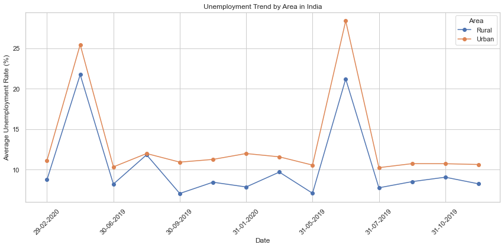

**The task**

Unemployment Analysis with Python

Unemployment is measured by the unemployment rate which is the number of people
who are unemployed as a percentage of the total labour force. We have seen a sharp
increase in the unemployment rate during Covid-19, so analyzing the unemployment rate can be a good data science project. 

***********

## **Unemployment in India: An Analysis of Trends and the Impact of COVID-19 Using Python**

**Introduction**

This report presents a detailed analysis of unemployment trends in India, with a particular focus on the impact of the COVID-19 pandemic. Using data from various regions across India, we explore overall unemployment trends, differences in rural and urban areas, regional disparities, and the relationship between unemployment and labor participation rates. The report concludes with policy recommendations to address identified challenges.

Unemployment is a critical socio-economic issue affecting countries globally. In India, the situation is compounded by its large and diverse population. The onset of the COVID-19 pandemic further exacerbated unemployment issues, making a comprehensive analysis both timely and necessary.

**Methodology: Data Analysis Steps**

Cleaning Process:
Corrected the column names by removing leading spaces.
Converted 'Date' columns to datetime format for accurate time series analysis.
Handled missing values and removed duplicates to ensure data integrity.

**Data Analysis**

Overall Unemployment Trend:
Grouped data by 'Date' and calculated the mean of 'Estimated Unemployment Rate (%)' to understand overall trends over time.

Unemployment Trend by Area (Rural vs Urban):
Segregated data into rural and urban areas. Compared unemployment trends in these areas to observe distinct patterns.

Regional Analysis:
Grouped data by 'Region' to calculate average unemployment rates, highlighting regional disparities.

**Comparative Analysis: Pre-COVID vs Post-COVID**

Defining Time Periods:
Classified data into two periods: Pre-COVID (before March 2020) and Post-COVID (from March 2020 onwards).

Comparative Metrics:
Calculated and compared the average unemployment rates for both periods to assess the impact of the COVID-19 pandemic.

**Relationship Analysis**

Unemployment vs Labor Participation:
Created a scatter plot to examine the correlation between unemployment rates and labor participation rates.

Utilized various types of plots (line charts, bar charts, scatter plots) to visually represent the data and trends for easier understanding and interpretation.

**Data Overview**

The analysis uses two datasets: 'Unemployment_in_India.csv' and 'Unemployment_Rate_upto_11_2020.csv', encompassing various regions in India, with data on unemployment rates, labor participation rates, and employment estimates.

## The Result of the Analysis

Overall Unemployment Trends

An analysis of the overall unemployment trend in India shows fluctuations over time, with notable peaks corresponding to certain events, including the COVID-19 pandemic.

**Unemployment Trends by Area: Rural vs Urban**

A comparative analysis of unemployment rates in rural and urban areas reveals significant differences. Urban areas typically show higher volatility in unemployment rates compared to rural regions.

5. Regional Disparities in Unemployment

A breakdown by region indicates that certain areas have higher unemployment rates. This disparity points to the need for region-specific economic policies.

**Relationship Between Unemployment and Labor Participation Rate**

The analysis suggests no clear linear correlation between the unemployment rate and labor participation rate, indicating that multiple factors influence unemployment.

**Comparative Analysis: Pre-COVID vs Post-COVID**

A stark contrast is observed when comparing the pre-COVID and post-COVID periods. The average unemployment rate nearly doubled post-COVID, indicating a substantial impact of the pandemic on employment.

**Policy Recommendations**

Based on the insights from the analysis, the following recommendations are proposed:

Targeted Economic Support: Implement region-specific job creation programs, especially in areas with high unemployment rates.

Enhance Labor Participation: Encourage labor participation through vocational training and education initiatives.

Pandemic Recovery Plans: Develop specific strategies to address the economic fallout from COVID-19, including support for affected industries and temporary employment schemes.

Economic Diversification: Promote economic diversification in regions heavily reliant on specific sectors to reduce vulnerability to industry-specific downturns.

Data-Driven Policymaking: Utilize ongoing data analytics to inform policy decisions and adapt strategies as needed.
